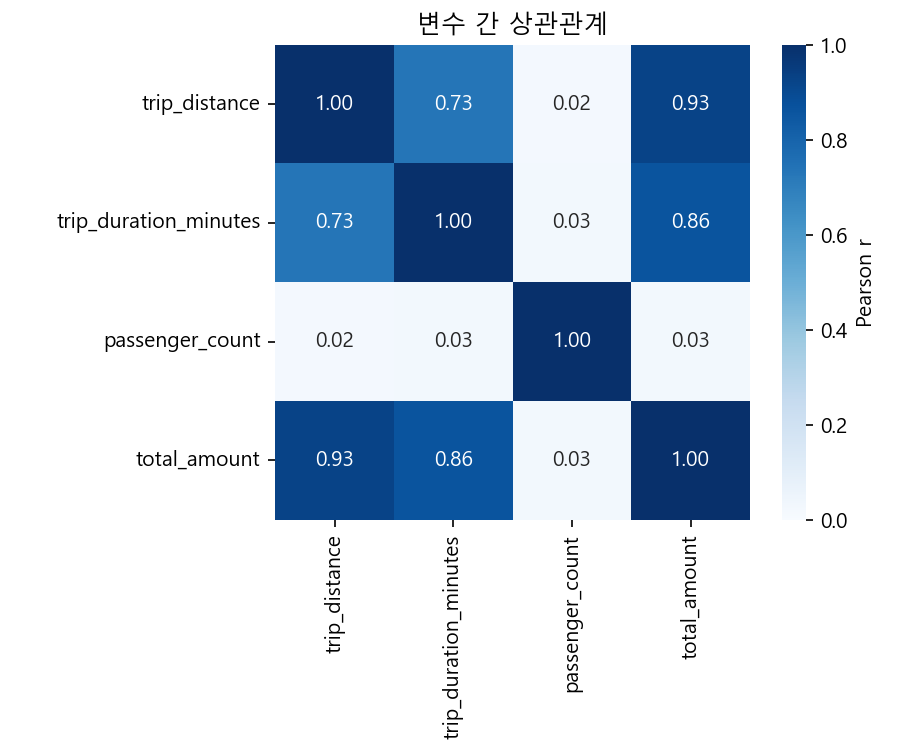
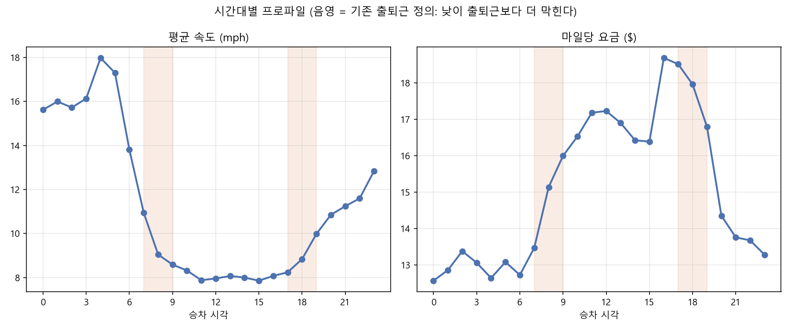

# NYC Yellow Taxi End-to-End 최종 종합 분석 보고서

> 이 문서는 최초 분석(v1)부터 시간대 밴드 재설계(v3)까지의 개선 과정을 종합해 Jinja2로 자동 생성한 최종 보고서입니다.

- 생성 시각: `2026-08-08 17:28:55`
- 분석 기간: `2026-01 ~ 2026-05`
- 대상: 평일·기본 요금제(`RatecodeID == 1`) 운행

## 1. 데이터 준비 및 교차 검증

- 분석용 원천 로딩 데이터: **18,999,282행, 선택 컬럼 6개**
- 정제 후 데이터: **9,068,557행, 12열**
- 분석 그룹: 출퇴근 3,061,386건 / 비출퇴근 6,007,171건
- 정제 후 중복 행: **0건**

### 정제 후 결측치

- 없음 (0건)

### Pandas·Polars 결과 비교

- Pass — 원천 데이터 shape
- Pass — 정제 후 shape
- Pass — 정제 후 컬럼
- Pass — 정제 후 결측치
- Pass — 정제 후 논리 자료형
- Pass — 주요 수치 컬럼 평균·합계

**전체 정제 결과 비교: Pass**

## 2. 분석 개선 과정

최초 가설의 결과가 통계적으로는 유의하지만 실질적으로 작게 나타나, 지표와 그룹 정의를 단계적으로 개선했습니다.

| 단계 | 질문 | 개선 내용 | 핵심 결과 | 상세 보고서 |
|---|---|---|---|---|
| 최초 분석 (v1) | 출퇴근과 비출퇴근의 총요금·이동거리는 다른가? | 기본 그룹 비교와 Welch t-test를 수행 | 총요금 평균 차이는 $0.62. 통계적으로 유의했지만 실질적 크기는 아직 평가하지 못함 | [열기](report_v1.md) |
| 1차 개선 (v2) | 총요금이 비슷하게 보이는 이유를 속도와 단가로 분해할 수 있는가? | speed_mph·fare_per_mile과 Cohen's d를 추가 | 출퇴근 속도 6.2% 감소, 마일당 요금 7.3% 증가. 다만 모든 효과크기는 매우 작음 | [열기](report_v2.md) |
| 2차 개선 (v3) | 출퇴근·비출퇴근 이분법이 시간대별 차이를 가리고 있는가? | 하루를 5개 시간대 밴드로 재구성하고 낮·심야를 비교 | 낮 평균 속도가 심야보다 48.4% 낮고, Cohen's d=-1.53로 큰 효과 | [열기](report_v3.md) |

v1~v3는 동일 데이터에서 가설과 그룹 정의를 발전시킨 **탐색적 분석 과정**입니다. 최종 헤드라인 검정은 시간대별 EDA에서 가장 뚜렷한 차이를 보인 낮과 심야를 비교합니다.

## 3. 기술통계 및 상관분석

### 전체 기술통계

|                       |     count |   mean |    std |   min |   25% |    50% |   75% |     max |
|:----------------------|----------:|-------:|-------:|------:|------:|-------:|------:|--------:|
| trip_distance         | 9,068,557 |  2.542 |  2.974 | 0.01  |  0.94 |  1.54  |  2.7  |  97.78  |
| total_amount          | 9,068,557 | 26.158 | 16.018 | 0.5   | 16.55 | 21.42  | 29.25 | 489.83  |
| trip_duration_minutes | 9,068,557 | 15.131 | 10.772 | 0.017 |  7.7  | 12.433 | 19.5  | 299.633 |

### 상관행렬

|                       |   trip_distance |   trip_duration_minutes |   passenger_count |   total_amount |
|:----------------------|----------------:|------------------------:|------------------:|---------------:|
| trip_distance         |           1     |                   0.732 |             0.022 |          0.926 |
| trip_duration_minutes |           0.732 |                   1     |             0.026 |          0.863 |
| passenger_count       |           0.022 |                   0.026 |             1     |          0.025 |
| total_amount          |           0.926 |                   0.863 |             0.025 |          1     |

## 4. 최종 분석 — 시간대 밴드 재설계(v3)

출퇴근·비출퇴근 이분법에서는 심야와 낮 시간대가 하나의 비출퇴근 그룹에 함께 포함되어 평균 차이가 상쇄됐습니다. 이를 보완하기 위해 하루를 5개 시간대 밴드로 재구성했습니다.

### 시간대 밴드별 기술통계

| time_band    |         n |   speed_mph_mean |   speed_mph_std |   fare_per_mile_mean |   fare_per_mile_std |   trip_distance_mean |   trip_distance_std |   total_amount_mean |   total_amount_std |
|:-------------|----------:|-----------------:|----------------:|---------------------:|--------------------:|---------------------:|--------------------:|--------------------:|-------------------:|
| 심야(0~6시)     |   455,671 |           15.532 |           7.969 |               12.807 |              30.789 |                3.563 |               3.925 |              26.924 |             18.2   |
| 출근피크(7~9시)   | 1,070,422 |            9.345 |           4.651 |               15.059 |              20.657 |                2.328 |               2.704 |              23.806 |             15.528 |
| 낮(10~16시)    | 3,601,067 |            8.02  |           4.392 |               17.073 |              25.932 |                2.386 |               2.889 |              26.21  |             16.823 |
| 퇴근피크(17~19시) | 1,990,727 |            8.989 |           4.516 |               17.794 |              26.997 |                2.334 |               2.725 |              26.796 |             14.63  |
| 밤(20~23시)    | 1,949,861 |           11.48  |           6.165 |               13.836 |              22.012 |                2.919 |               3.16  |              26.528 |             15.44  |

### Welch t-test: 낮(10~16시) vs 심야(0~6시)

| metric        |   day_mean |   night_mean |   diff_pct |    t_stat | p_value   |   cohens_d | effect_size   |
|:--------------|-----------:|-------------:|-----------:|----------:|:----------|-----------:|:--------------|
| speed_mph     |     8.0201 |      15.5322 |   -48.3644 | -624.419  | < 0.001   |    -1.5253 | 큼             |
| fare_per_mile |    17.0727 |      12.8067 |    33.3105 |   89.5938 | < 0.001   |     0.1608 | 무시가능          |
| trip_distance |     2.3862 |       3.5632 |   -33.0322 | -195.842  | < 0.001   |    -0.3893 | 작음            |
| total_amount  |    26.2099 |      26.9236 |    -2.6506 |  -25.1448 | < 0.001   |    -0.042  | 무시가능          |

- 표본이 매우 크므로 p-value만으로 중요성을 판단하지 않고 Cohen's d와 변화율을 함께 해석했습니다.
- `p-value < 0.001`은 통계적으로 유의함을 뜻하며, 인과관계를 의미하지는 않습니다.

## 5. 머신러닝 Pipeline

`trip_distance`, `trip_duration_minutes`, `pickup_hour`, `is_rush_hour`를 입력으로 사용해 `total_amount`를 예측했습니다.

- 구성: `StandardScaler` + `LinearRegression`
- 분할: 학습 80% / 평가 20%, `random_state=42`
- 저장 모델: `models/total_amount_regression_pipeline.joblib`

|   RMSE |   MAE |     R² |   평가 표본 수 |
|-------:|------:|-------:|----------:|
|  4.132 |  2.43 | 0.9333 | 1,813,712 |

모델의 MAE는 $2.43이며, 개별 운행의 총요금 예측에서 평균 절대오차가 약 $2.43이라는 의미입니다. 이 모델은 시간대 효과를 정교하게 설명하기 위한 모델이 아니라 재현 가능한 기본 회귀 Pipeline입니다.

## 6. 시각화 산출물

- [상관관계 히트맵](outputs/figures/correlation_heatmap.png)
- [출퇴근·비출퇴근 박스 플롯](outputs/figures/rush_vs_nonrush_boxplot.png)
- [속도·마일당 요금 박스 플롯](outputs/figures/speed_fare_boxplot_v2.png)
- [시간대별 프로파일](outputs/figures/hourly_profile_v3.png)
- [시간대 밴드별 속도 박스 플롯](outputs/figures/band_speed_boxplot_v3.png)
- [시간대별 인터랙티브 Plotly 차트](outputs/figures/hourly_profile_interactive.html)

## 7. 최종 해석과 한계

### 핵심 결과

- 낮(10~16시)의 평균 속도는 심야(0~6시)보다 48.4% 낮고 효과크기는 큽니다(d=-1.53).
- 낮의 평균 이동거리는 심야보다 33.0% 짧아 시간대별 운행 구성이 다릅니다.
- 총요금은 2.7% 차이가 있지만 효과크기는 -0.04로 실질적 차이는 미미합니다.

### 해석 시 주의점

- v3의 낮·심야 비교는 시간대별 EDA 이후 선택한 탐색적 후속 분석입니다.
- `fare_per_mile`은 기본요금·팁·통행료·할증과 짧은 운행의 영향을 함께 받으므로 정체의 순수한 인과효과로 해석할 수 없습니다.
- 시간대별 차이는 운행 지역과 이동거리 구성의 영향도 받을 수 있습니다.
- 회귀모델은 성능 확인을 위한 baseline이며 시간대의 비선형 패턴을 완전히 반영하지 않습니다.

## 8. 결론

시간대에 따라 총요금 자체보다 운행의 **구성**이 달라집니다. 낮에는 평균 속도와 이동거리가 낮고, 심야에는 더 빠르고 긴 운행이 나타납니다. 총요금의 실질적 차이는 작지만 거리·속도·단가를 분해하면 시간대별 운행 특성이 분명하게 드러납니다.