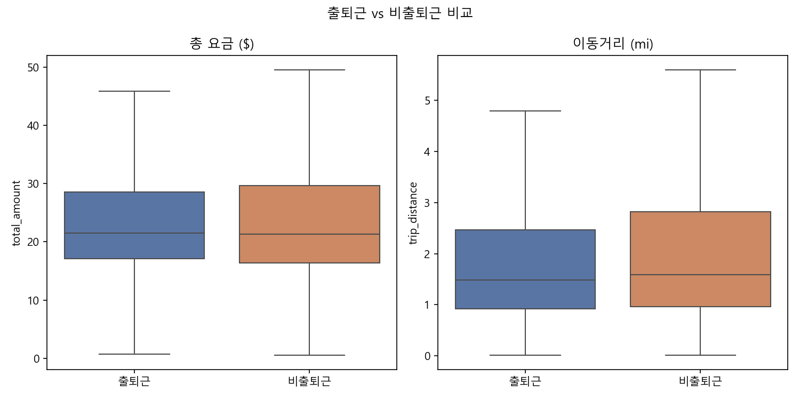

# NYC 옐로우 택시 분석 — 최초 분석: 출퇴근 vs 비출퇴근 (v1)

- 대상 기간: 2026-01 ~ 2026-05 (평일, RatecodeID==1, 이상치 제거 후)
- 총 trip 수: 9,068,557 (출퇴근 3,061,386 / 비출퇴근 6,007,171)

## 1. 그룹별 기술통계 (평균 ± 표준편차)

| analysis_group   |   trip_distance_mean |   trip_distance_std |   total_amount_mean |   total_amount_std |   trip_duration_minutes_mean |   trip_duration_minutes_std |
|:-----------------|---------------------:|--------------------:|--------------------:|-------------------:|-----------------------------:|----------------------------:|
| 비출퇴근             |                2.649 |               3.091 |              26.366 |             16.5   |                       15.459 |                      10.98  |
| 출퇴근              |                2.332 |               2.719 |              25.75  |             15.019 |                       14.488 |                      10.321 |

## 2. 상관행렬

|                       |   trip_distance |   trip_duration_minutes |   passenger_count |   total_amount |
|:----------------------|----------------:|------------------------:|------------------:|---------------:|
| trip_distance         |           1     |                   0.732 |             0.022 |          0.926 |
| trip_duration_minutes |           0.732 |                   1     |             0.026 |          0.863 |
| passenger_count       |           0.022 |                   0.026 |             1     |          0.025 |
| total_amount          |           0.926 |                   0.863 |             0.025 |          1     |

## 3. t-test (출퇴근 vs 비출퇴근, Welch)

| metric        |   rush_mean |   non_rush_mean |    diff |    t_stat |   p_value | significant_at_0.05   |
|:--------------|------------:|----------------:|--------:|----------:|----------:|:----------------------|
| total_amount  |     25.7504 |         26.3663 | -0.6159 |  -56.4567 |         0 | True                  |
| trip_distance |      2.3323 |          2.6488 | -0.3165 | -158.134  |         0 | True                  |

## 4. 선형회귀 (total_amount 예측)

| feature               |   coefficient_scaled |
|:----------------------|---------------------:|
| trip_distance         |              10.1832 |
| trip_duration_minutes |               6.3897 |
| pickup_hour           |               0.553  |
| is_rush_hour          |               0.5193 |
| intercept             |              26.161  |

- RMSE: 4.1318
- MAE: 2.4301
- R^2: 0.9333
- test set 크기: 1,813,712
