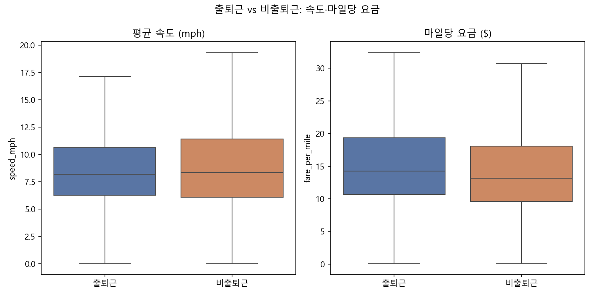

# NYC 옐로우 택시 분석 — 1차 개선: 지표 분해와 효과크기 (v2)

v1에서는 `total_amount`만 비교했는데, 출퇴근 시간대는 이동거리는 짧아 거리 요금이 줄고 정체로 속도는 느려 시간 요금이 느는 두 효과가 서로 상쇄되어 총 요금 차이가 실질적으로 거의 없어 보였다. v2에서는 `speed_mph`(평균 속도), `fare_per_mile`(마일당 요금)을 추가로 분해하고, 표본이 9백만 건이라 p-value가 항상 0에 가깝게 나오는 문제를 보완하기 위해 Cohen's d(효과크기)를 함께 본다.

## 1. 그룹별 기술통계

| analysis_group   |   total_amount_mean |   total_amount_std |   trip_distance_mean |   trip_distance_std |   speed_mph_mean |   speed_mph_std |   fare_per_mile_mean |   fare_per_mile_std |
|:-----------------|--------------------:|-------------------:|---------------------:|--------------------:|-----------------:|----------------:|---------------------:|--------------------:|
| 비출퇴근             |              26.367 |             16.499 |                2.648 |               3.089 |            9.713 |           5.833 |               15.698 |              25.204 |
| 출퇴근              |              25.751 |             15.018 |                2.332 |               2.717 |            9.114 |           4.567 |               16.837 |              24.998 |

## 2. t-test + 효과크기 (Cohen's d)

| metric        |   rush_mean |   non_rush_mean |   diff_pct |    t_stat |   p_value |   cohens_d | effect_size   |
|:--------------|------------:|----------------:|-----------:|----------:|----------:|-----------:|:--------------|
| total_amount  |     25.7509 |         26.3672 |    -2.3375 |  -56.4991 |         0 |    -0.0385 | 무시가능          |
| trip_distance |      2.332  |          2.6485 |   -11.9481 | -158.202  |         0 |    -0.1066 | 무시가능          |
| speed_mph     |      9.1137 |          9.7131 |    -6.1714 | -169.697  |         0 |    -0.1102 | 무시가능          |
| fare_per_mile |     16.8373 |         15.6984 |     7.2548 |   64.695  |         0 |     0.0453 | 무시가능          |

## 3. 해석

- `total_amount`: 출퇴근이 약 2.3% 낮음. p<0.001로 통계적으로 유의하지만 Cohen's d=-0.04로 무시할 수준 — v1에서 "차이가 없어 보인다"고 느낀 게 데이터상으로도 맞았다.
- `trip_distance`: 출퇴근이 약 11.9% 짧음 (통근형 단거리 이동).
- `speed_mph`: 출퇴근이 약 6.2% 느림 (정체 반영).
- `fare_per_mile`: 출퇴근이 약 7.3% 비쌈 (같은 거리라도 시간 요금 때문에 단가가 오름).
- 4개 지표 모두 Cohen's d 기준으로는 '무시가능'~'작음' 수준이라, trip 단위로 보면 그룹 내 편차가 그룹 간 평균 차이보다 훨씬 크다. 다만 %차이 자체는 방향이 뚜렷하고 (짧고, 느리고, 마일당 비싸고) 정체·통근 패턴과 일치해 **총 요금보다 거리/속도/단가 지표가 훨씬 해석 가능한 스토리**를 준다.

## 4. 회귀모델 (v1과 동일, 재사용)

| feature               |   coefficient_scaled |
|:----------------------|---------------------:|
| trip_distance         |              10.1832 |
| trip_duration_minutes |               6.3897 |
| pickup_hour           |               0.553  |
| is_rush_hour          |               0.5193 |
| intercept             |              26.161  |

- RMSE: 4.1318
- MAE: 2.4301
- R^2: 0.9333
