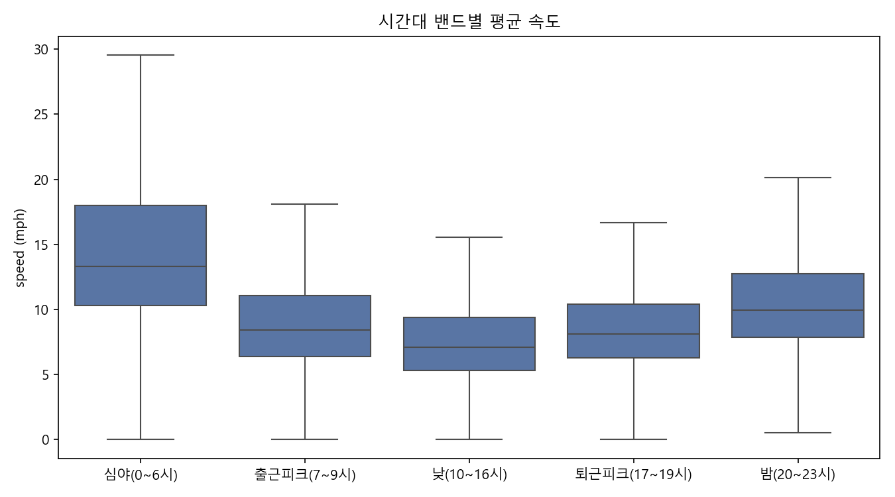

# NYC 옐로우 택시 분석 — 2차 개선: 시간대 밴드 재설계 (v3)

## 왜 v3인가

v1·v2의 출퇴근(7~9, 17~19시) vs 비출퇴근 이분법은 효과크기가 전부 '무시가능' 수준이었다. 원인은 그룹 경계 자체에 있었다: '비출퇴근' 안에 가장 빠른 심야(15~18mph)와 가장 막히는 낮 10~16시(약 8mph)가 함께 묶여 서로 상쇄됐고, 실제로 낮 시간대는 출퇴근 피크보다도 느리다. 뉴욕 택시에게 혼잡은 '출퇴근 시간'이 아니라 '낮 전체'다. v3에서는 `pickup_hour`를 5개 시간대 밴드로 재그룹핑하고, 대비가 가장 뚜렷한 **낮(10~16시) vs 심야(0~6시)**를 헤드라인 검정으로 잡았다.

## 1. 시간대 밴드별 기술통계

| time_band    |         n |   speed_mph_mean |   speed_mph_std |   fare_per_mile_mean |   fare_per_mile_std |   trip_distance_mean |   trip_distance_std |   total_amount_mean |   total_amount_std |
|:-------------|----------:|-----------------:|----------------:|---------------------:|--------------------:|---------------------:|--------------------:|--------------------:|-------------------:|
| 심야(0~6시)     |   455,671 |           15.532 |           7.969 |               12.807 |              30.789 |                3.563 |               3.925 |              26.924 |             18.2   |
| 출근피크(7~9시)   | 1,070,422 |            9.345 |           4.651 |               15.059 |              20.657 |                2.328 |               2.704 |              23.806 |             15.528 |
| 낮(10~16시)    | 3,601,067 |            8.02  |           4.392 |               17.073 |              25.932 |                2.386 |               2.889 |              26.21  |             16.823 |
| 퇴근피크(17~19시) | 1,990,727 |            8.989 |           4.516 |               17.794 |              26.997 |                2.334 |               2.725 |              26.796 |             14.63  |
| 밤(20~23시)    | 1,949,861 |           11.48  |           6.165 |               13.836 |              22.012 |                2.919 |               3.16  |              26.528 |             15.44  |

## 2. t-test: 낮(10~16시) vs 심야(0~6시)

| metric        |   day_mean |   night_mean |   diff_pct |    t_stat |   p_value |   cohens_d | effect_size   |
|:--------------|-----------:|-------------:|-----------:|----------:|----------:|-----------:|:--------------|
| speed_mph     |     8.0201 |      15.5322 |   -48.3644 | -624.419  |         0 |    -1.5253 | 큼             |
| fare_per_mile |    17.0727 |      12.8067 |    33.3105 |   89.5938 |         0 |     0.1608 | 무시가능          |
| trip_distance |     2.3862 |       3.5632 |   -33.0322 | -195.842  |         0 |    -0.3893 | 작음            |
| total_amount  |    26.2099 |      26.9236 |    -2.6506 |  -25.1448 |         0 |    -0.042  | 무시가능          |

## 3. 해석

- `speed_mph`: 낮이 심야보다 **48% 느림, Cohen's d = -1.53 (큼)** — v1·v2에서 못 보던 실질적으로 큰 차이. 그룹 경계를 데이터에 맞게 다시 그으니 효과가 드러났다.
- `trip_distance`: 낮이 33% 짧음 (d = -0.39, 작음). 심야는 장거리 이동 비중이 높다.
- `fare_per_mile`: 낮이 33% 비쌈 — 같은 거리를 가도 정체 때문에 시간 요금이 붙는다. (d는 0.16으로 작게 나오는데, 단거리 trip에서 마일당 요금 분산이 매우 커서 그룹 내 편차가 크기 때문)
- `total_amount`: 여전히 차이 없음 (d = -0.04). **총 요금은 시간대와 거의 무관하다** — 낮에는 '짧은 거리를 비싼 단가로', 심야에는 '긴 거리를 싼 단가로' 이동해 총액이 비슷해진다. 이것이 v1이 밋밋해 보였던 근본 이유다.

## 결론

요금 구조의 차이는 총액(`total_amount`)이 아니라 **구성**(거리 × 단가)에 있다. 시간대는 '얼마를 내는가'가 아니라 '무엇에 대해 내는가'(거리 vs 정체 시간)를 바꾼다.
